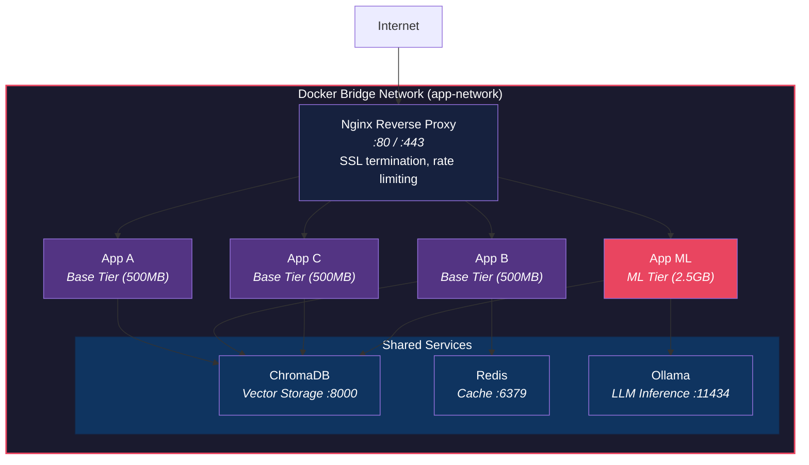

<div align="center">

# VPS Deploy Playbook

[](https://docs.docker.com/compose/)
[](https://nginx.org/)
[](LICENSE)
[](https://ubuntu.com/)
[](#chapters)

**Deploy multiple apps on a single VPS with Docker — from zero to production. Battle-tested patterns from running 21+ containers.**

[Quick Start](#quick-start) | [Architecture](#architecture) | [Chapters](#chapters) | [FAQ](./FAQ.md)

</div>

---

## Table of Contents

- [Features](#features)
- [Architecture](#architecture)
- [Quick Start](#quick-start)
- [Chapters](#chapters)
  - [01 - VPS Setup](#01---vps-setup)
  - [02 - Docker Foundation](#02---docker-foundation)
  - [03 - Nginx Routing](#03---nginx-routing)
  - [04 - Multi-App Architecture](#04---multi-app-architecture)
  - [05 - Selective Updates](#05---selective-updates)
  - [06 - Monitoring](#06---monitoring)
  - [07 - Automated Backups](#07---automated-backups)
  - [08 - CI/CD](#08---cicd)
- [How It Works](#how-it-works)
  - [Image Layering Strategy](#1-image-layering-strategy)
  - [Shared Services](#2-shared-services)
  - [Subdomain Routing](#3-subdomain-routing)
  - [Selective Deployment](#4-selective-deployment)
- [Project Structure](#project-structure)
- [Reference Docs](#reference-docs)
- [Makefile Commands](#makefile-commands)
- [Roadmap](#roadmap)
- [Contributing](#contributing)
- [License](#license)
- [Author](#author)

## Features

- **Single-network architecture** — all containers on one Docker bridge, DNS-based service discovery
- **Image layering strategy** — 500MB base tier + 2.5GB ML tier, reducing disk usage by 7x across 21 containers
- **Subdomain routing** — `app-a.example.com` → container A via Nginx reverse proxy, SSL with Let's Encrypt
- **Shared services** — one ChromaDB instance serving 21 apps instead of 21 separate instances
- **Selective deployments** — update one container in 30 seconds without touching the other twenty
- **Per-container resource limits** — CPU + memory caps prevent one runaway service from taking down everything
- **Automated backups** — daily volume backups with off-site storage via rclone
- **CI/CD with GitHub Actions** — push to main, auto-deploy changed services via SSH
- **Lightweight monitoring** — health checks, cron-based alerts to Discord/Telegram, no Prometheus overhead
- **Makefile shortcuts** — `make deploy s=app-chatbot`, `make logs s=nginx`, `make audit`

## Architecture



## Quick Start

```bash
# Clone this playbook
git clone https://github.com/adityonugrohoid/vps-deploy-playbook.git
cd vps-deploy-playbook

# Start with Chapter 01 — VPS hardening
cd 01-vps-setup
```

Or jump directly to a chapter:

```bash
cd 04-multi-app-architecture  # The crown jewel — image layering + shared services
```

## Chapters

### 01 — VPS Setup
**[Read Chapter →](./01-vps-setup/)**

SSH hardening, UFW firewall, Fail2Ban, non-root user setup. Get a fresh Ubuntu server production-ready in 15 minutes.

### 02 — Docker Foundation
**[Read Chapter →](./02-docker-foundation/)**

Docker installation (the modern way), single-network architecture, Compose patterns, volume management, and common gotchas.

### 03 — Nginx Routing
**[Read Chapter →](./03-nginx-routing/)**

Reverse proxy setup, subdomain-to-container routing, SSL with Let's Encrypt, rate limiting, and WebSocket support. Includes a working `nginx.conf`.

### 04 — Multi-App Architecture
**[Read Chapter →](./04-multi-app-architecture/)**

The crown jewel. Image layering strategy (500MB base vs 2.5GB ML tier), shared ChromaDB pattern, container organization for 21+ services, resource limits, and the full-stack compose template.

### 05 — Selective Updates
**[Read Chapter →](./05-selective-updates/)**

Per-app deployment via SSH, the `deploy.sh` script, rollback strategy, and blue-green deployment lite. Update one container, not twenty-one.

### 06 — Monitoring
**[Read Chapter →](./06-monitoring/)**

Docker health checks, log management with rotation, resource monitoring with `docker stats`, cron-based alerting to Discord/Telegram/email, and disk space strategies.

### 07 — Automated Backups
**[Read Chapter →](./07-automated-backups/)**

Volume backup script, database dumps (ChromaDB, Redis, PostgreSQL), off-site storage with rclone, automated scheduling, and restore procedures.

### 08 — CI/CD
**[Read Chapter →](./08-ci-cd/)**

GitHub Actions workflows for auto-deploy on push, GHCR integration, multi-service change detection, secrets management, and rollback via workflow dispatch.

## How It Works

### 1. Image Layering Strategy

The single most impactful decision for running many containers efficiently:

| Tier | Size | Contents | Used By |
|------|------|----------|---------|
| **Base** | ~500MB | Python + FastAPI + httpx + pydantic | 15 services |
| **ML** | ~2.5GB | Base + torch + sentence-transformers | 6 services |
| **App layer** | ~50MB | App-specific code only | Each service |

**Result:** 4GB total disk vs 30GB without layering — a **7x reduction**. Updates pull ~50MB per service instead of ~800MB.

### 2. Shared Services

One ChromaDB instance serves all 21 apps via isolated collections:

| Factor | 1 Shared | 21 Separate |
|--------|----------|-------------|
| Memory | ~512MB | ~10.7GB |
| Disk | ~2GB | ~42GB |
| Backup jobs | 1 | 21 |

### 3. Subdomain Routing

Nginx routes subdomains to containers via the Docker bridge network:

```
app-a.example.com  →  Nginx :443  →  app-a:8080
app-b.example.com  →  Nginx :443  →  app-b:8081
api.example.com    →  Nginx :443  →  api-service:3000
```

No container exposes ports to the host except Nginx (80/443).

### 4. Selective Deployment

```bash
# Update one service in ~30 seconds
make deploy s=app-chatbot

# Or via SSH
ssh vps "cd /opt/apps && docker compose up -d --build app-chatbot"
```

Other 20 containers are untouched. Zero downtime for unrelated services.

## Project Structure

```
vps-deploy-playbook/
├── README.md                          # This file
├── .env.example                       # Environment variable template
├── .gitignore                         # Git ignore rules
├── Makefile                           # Common operations (deploy, logs, audit)
│
├── 01-vps-setup/                      # SSH, firewall, fail2ban
│   └── README.md
├── 02-docker-foundation/              # Docker install, networking, compose
│   ├── README.md
│   └── docker-compose.base.yml        #   Base compose template
├── 03-nginx-routing/                  # Reverse proxy, SSL, rate limiting
│   ├── README.md
│   ├── nginx.conf                     #   Working multi-app nginx config
│   └── docker-compose.yml             #   Nginx + certbot compose
├── 04-multi-app-architecture/         # Image layering, shared services
│   ├── README.md
│   ├── architecture.md                #   ASCII architecture diagrams
│   └── docker-compose.yml             #   Full 21-service compose template
├── 05-selective-updates/              # Per-app deployment
│   ├── README.md
│   └── deploy.sh                      #   Selective deploy script
├── 06-monitoring/                     # Health checks, alerting
│   └── README.md
├── 07-automated-backups/              # Volume backups, rclone
│   └── README.md
├── 08-ci-cd/                          # GitHub Actions workflows
│   └── README.md
│
├── CONTRIBUTING.md                    # Contribution guidelines
├── CODE_OF_CONDUCT.md                 # Community standards
├── TROUBLESHOOTING.md                 # Common issues and fixes
├── SECURITY_CHECKLIST.md              # Hardening audit reference
├── FAQ.md                             # Frequently asked questions
├── docker-compose.env.md              # Environment variable reference
└── LICENSE                            # MIT License
```

## Reference Docs

| Document | Description |
|----------|-------------|
| [Troubleshooting](./TROUBLESHOOTING.md) | Docker, Nginx, SSH issues with diagnostic commands |
| [Security Checklist](./SECURITY_CHECKLIST.md) | Server, Docker, Nginx hardening audit |
| [FAQ](./FAQ.md) | K8s vs VPS, costs, ARM, scaling, production readiness |
| [Environment Variables](./docker-compose.env.md) | All config variables mapped to services |
| [Architecture Diagrams](./04-multi-app-architecture/architecture.md) | Image layers, service graph, network topology |

## Makefile Commands

```bash
make status          # Show all container status
make stats           # Resource usage (CPU, memory)
make deploy s=app    # Deploy a specific service
make logs s=app      # Tail logs for a service
make nginx-reload    # Test and reload Nginx config
make backup          # Run backup script
make cleanup         # Remove unused Docker images
make audit           # Security audit checks
make disk            # Disk usage summary
make help            # Show all commands
```

## Roadmap

- [x] VPS hardening (SSH, UFW, Fail2Ban)
- [x] Docker installation and single-network architecture
- [x] Nginx subdomain routing with SSL
- [x] Image layering strategy (base + ML tiers)
- [x] Shared services pattern (ChromaDB)
- [x] Selective per-app deployment scripts
- [x] Health checks and lightweight alerting
- [x] Automated backups with off-site storage
- [x] CI/CD with GitHub Actions
- [ ] Chapter 09: Automated backup with encryption
- [ ] Chapter 10: Multi-VPS scaling with WireGuard
- [ ] Replace ASCII diagrams with SVG architecture images
- [ ] Add Terraform IaC for VPS provisioning
- [ ] Ansible playbook for server setup automation

## Contributing

Found a better pattern? See [CONTRIBUTING.md](./CONTRIBUTING.md) for guidelines. Open a PR or an issue — this playbook improves with community input.

## License

This project is licensed under the [MIT License](LICENSE).

## Author

**Adityo Nugroho** ([@adityonugrohoid](https://github.com/adityonugrohoid)) — AI Solutions Engineer with 18+ years in high-throughput network operations. Built from real production experience running 21+ containerized services on a single VPS.
