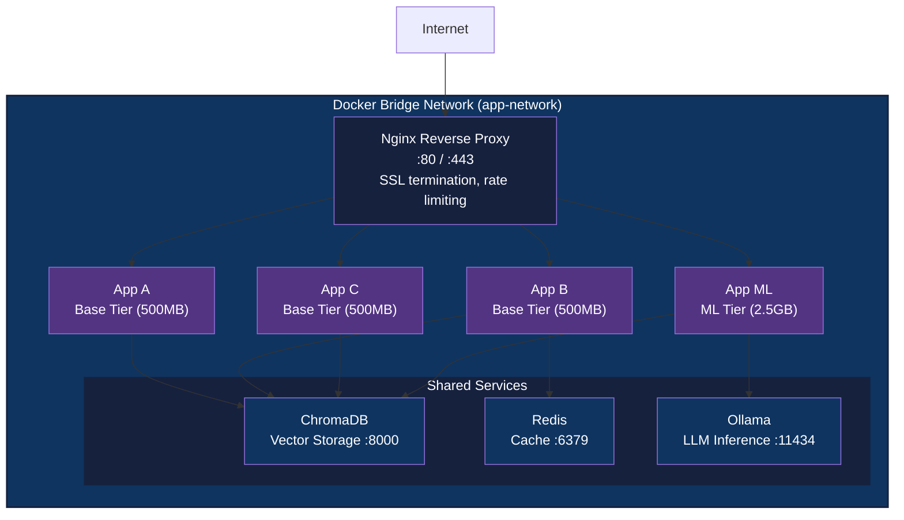

<div align="center">

# VPS Deploy Playbook

[](https://www.gnu.org/software/bash/)
[](https://docs.docker.com/compose/)
[](https://nginx.org/)
[](LICENSE)

**Deploy multiple apps on a single VPS with Docker, from zero to production. Patterns from 21+ live containers**

[Getting Started](#getting-started) | [Chapters](#chapters) | [How It Works](#how-it-works)

</div>

---

## Table of Contents

- [The Problem](#the-problem)
- [Features](#features)
- [Tech Stack](#tech-stack)
- [Architecture](#architecture)
- [Getting Started](#getting-started)
  - [Prerequisites](#prerequisites)
  - [Installation](#installation)
- [Chapters](#chapters)
- [Usage](#usage)
- [How It Works](#how-it-works)
  - [Image Layering Strategy](#1-image-layering-strategy)
  - [Shared Services](#2-shared-services)
  - [Subdomain Routing](#3-subdomain-routing)
  - [Selective Deployment](#4-selective-deployment)
- [Architectural Decisions](#architectural-decisions)
- [Project Structure](#project-structure)
- [Security](#security)
- [License](#license)
- [Author](#author)

## The Problem

### Running many apps on limited hardware

A single VPS can host dozens of apps, but naive container sprawl burns disk fast: 21 services each pulling a 2.5GB ML image costs 52GB before the first request. Shared infrastructure (databases, caches, vector stores) multiplies that waste. And rolling deployments that restart every container to update one service kill availability for everything else.

### The Solution

This playbook documents the patterns that cut a 21-service stack to 4GB total disk via image layering, consolidate shared services (ChromaDB, Redis) to a single instance, and deliver 30-second selective deployments. Eight numbered chapters walk each concern from VPS hardening to CI/CD, with working configs included.

## Features

- **Single-network architecture** - all containers on one Docker bridge, DNS-based service discovery
- **Image layering strategy** - 500MB base tier + 2.5GB ML tier, reducing disk usage by 7x across 21 containers
- **Subdomain routing** - `app-a.example.com` to container A via Nginx reverse proxy, SSL with Let's Encrypt
- **Shared services** - one ChromaDB instance serving 21 apps instead of 21 separate instances
- **Selective deployments** - update one container in 30 seconds without touching the other twenty
- **Per-container resource limits** - CPU and memory caps prevent one runaway service from taking down everything
- **Automated backups** - daily volume backups with off-site storage via rclone
- **CI/CD with GitHub Actions** - push to main, auto-deploy changed services via SSH
- **Lightweight monitoring** - health checks, cron-based alerts to Discord/Telegram, no Prometheus overhead
- **Makefile shortcuts** - `make deploy s=app-chatbot`, `make logs s=nginx`, `make audit`

## Tech Stack

| Component | Technology |
|-----------|------------|
| Language | Bash |
| Reverse Proxy | Nginx (subdomain routing, SSL termination) |
| Containerisation | Docker Compose (multi-service orchestration) |
| SSL | Let's Encrypt via Certbot |
| CI/CD | GitHub Actions + GHCR |
| Off-site Backup | rclone |
| Alerting | cron + Discord/Telegram webhooks |

## Architecture


```mermaid
graph TD
    Internet["Internet"]

    Internet --> Nginx["Nginx Reverse Proxy\n:80 / :443\nSSL termination, rate limiting"]

    Nginx --> AppA["App A\nBase Tier (500MB)"]
    Nginx --> AppB["App B\nBase Tier (500MB)"]
    Nginx --> AppC["App C\nBase Tier (500MB)"]
    Nginx --> AppML["App ML\nML Tier (2.5GB)"]

    subgraph SharedServices["Shared Services"]
        ChromaDB["ChromaDB\nVector Storage :8000"]
        Redis["Redis\nCache :6379"]
        Ollama["Ollama\nLLM Inference :11434"]
    end

    AppA --> ChromaDB
    AppB --> ChromaDB
    AppB --> Redis
    AppC --> ChromaDB
    AppML --> ChromaDB
    AppML --> Ollama

    subgraph Network["Docker Bridge Network (app-network)"]
        Nginx
        AppA
        AppB
        AppC
        AppML
        SharedServices
    end

    style Network fill:#0f3460,stroke:#16213e,stroke-width:2px,color:#fff
    style SharedServices fill:#16213e,stroke:#0f3460,stroke-width:1px,color:#fff
    style Nginx fill:#16213e,color:#fff
    style AppA fill:#533483,color:#fff
    style AppB fill:#533483,color:#fff
    style AppC fill:#533483,color:#fff
    style AppML fill:#533483,color:#fff
    style ChromaDB fill:#0f3460,color:#fff
    style Redis fill:#0f3460,color:#fff
    style Ollama fill:#0f3460,color:#fff
```

## Getting Started

### Prerequisites

- Ubuntu 22.04 or 24.04 VPS (1+ vCPU, 2GB+ RAM recommended)
- SSH access to the server
- Domain name with DNS A records pointing to your VPS IP
- Git (to clone this playbook)

### Installation

1. Clone the playbook:
   ```bash
   git clone https://github.com/adityonugrohoid/vps-deploy-playbook.git
   cd vps-deploy-playbook
   ```

2. Start with Chapter 01 for a fresh server, or jump to any chapter:
   ```bash
   cd 01-vps-setup          # Start here for a new VPS
   cd 04-multi-app-architecture  # Jump here for the architecture patterns
   ```

3. Copy the environment template and fill in your values:
   ```bash
   cp .env.example .env
   ```

See [docker-compose.env.md](./docker-compose.env.md) for the full variable reference.

## Chapters

### 01 - VPS Setup
**[Read Chapter](./01-vps-setup/)**

SSH hardening, UFW firewall, Fail2Ban, non-root user setup. Get a fresh Ubuntu server production-ready in 15 minutes.

### 02 - Docker Foundation
**[Read Chapter](./02-docker-foundation/)**

Docker installation (the modern way), single-network architecture, Compose patterns, volume management, and common gotchas.

### 03 - Nginx Routing
**[Read Chapter](./03-nginx-routing/)**

Reverse proxy setup, subdomain-to-container routing, SSL with Let's Encrypt, rate limiting, and WebSocket support. Includes a working `nginx.conf`.

### 04 - Multi-App Architecture
**[Read Chapter](./04-multi-app-architecture/)**

The core chapter. Image layering strategy (500MB base vs 2.5GB ML tier), shared ChromaDB pattern, container organization for 21+ services, resource limits, and the full-stack compose template.

### 05 - Selective Updates
**[Read Chapter](./05-selective-updates/)**

Per-app deployment via SSH, the `deploy.sh` script, rollback strategy, and blue-green deployment lite. Update one container, not twenty-one.

### 06 - Monitoring
**[Read Chapter](./06-monitoring/)**

Docker health checks, log management with rotation, resource monitoring with `docker stats`, cron-based alerting to Discord/Telegram/email, and disk space strategies.

### 07 - Automated Backups
**[Read Chapter](./07-automated-backups/)**

Volume backup script, database dumps (ChromaDB, Redis, PostgreSQL), off-site storage with rclone, automated scheduling, and restore procedures.

### 08 - CI/CD
**[Read Chapter](./08-ci-cd/)**

GitHub Actions workflows for auto-deploy on push, GHCR integration, multi-service change detection, secrets management, and rollback via workflow dispatch.

## Usage

Run Makefile commands from the repo root after deploying your stack:

```bash
make status          # Show all container status
make stats           # Resource usage (CPU, memory)
make deploy s=app    # Deploy a specific service
make logs s=app      # Tail logs for a service
make nginx-reload    # Test and reload Nginx config
make backup          # Run backup script
make cleanup         # Remove unused Docker images
make audit           # Security audit checks
make disk            # Disk usage summary
make help            # Show all commands
```

Reference docs:

| Document | Description |
|----------|-------------|
| [Troubleshooting](./TROUBLESHOOTING.md) | Docker, Nginx, SSH issues with diagnostic commands |
| [Security Checklist](./SECURITY_CHECKLIST.md) | Server, Docker, Nginx hardening audit |
| [FAQ](./FAQ.md) | K8s vs VPS, costs, ARM, scaling, production readiness |
| [Environment Variables](./docker-compose.env.md) | All config variables mapped to services |
| [Architecture Diagrams](./04-multi-app-architecture/architecture.md) | Image layers, service graph, network topology |

## How It Works

### 1. Image Layering Strategy

The single most impactful decision for running many containers efficiently:

| Tier | Size | Contents | Used By |
|------|------|----------|---------|
| **Base** | ~500MB | Python + FastAPI + httpx + pydantic | 15 services |
| **ML** | ~2.5GB | Base + torch + sentence-transformers | 6 services |
| **App layer** | ~50MB | App-specific code only | Each service |

Result: 4GB total disk vs 30GB without layering, a 7x reduction. Updates pull ~50MB per service instead of ~800MB.

### 2. Shared Services

One ChromaDB instance serves all 21 apps via isolated collections:

| Factor | 1 Shared | 21 Separate |
|--------|----------|-------------|
| Memory | ~512MB | ~10.7GB |
| Disk | ~2GB | ~42GB |
| Backup jobs | 1 | 21 |

### 3. Subdomain Routing

Nginx routes subdomains to containers via the Docker bridge network:

```
app-a.example.com  ->  Nginx :443  ->  app-a:8080
app-b.example.com  ->  Nginx :443  ->  app-b:8081
api.example.com    ->  Nginx :443  ->  api-service:3000
```

No container exposes ports to the host except Nginx (80/443).

### 4. Selective Deployment

```bash
# Update one service in ~30 seconds
make deploy s=app-chatbot

# Or via SSH directly
ssh vps "cd /opt/apps && docker compose up -d --build app-chatbot"
```

The other 20 containers are untouched. Zero downtime for unrelated services.

## Architectural Decisions

### 1. Single Docker bridge network

**Decision:** All 21 containers share one `app-network` bridge. No per-service networks.

**Reasoning:** DNS-based service discovery (`chromadb:8000` resolves from any container) eliminates container linking config. The security trade-off (flat network) is acceptable for a single-tenant VPS; the operational simplicity gain is large. Multi-network isolation would require explicit link config per service pair.

### 2. Shared ChromaDB over per-service instances

**Decision:** One ChromaDB instance with isolated collections, not 21 instances.

**Reasoning:** Per-service instances waste ~10GB RAM and complicate backup (21 jobs vs 1). ChromaDB's collection-level namespace provides sufficient logical isolation for multi-app deployments. The single point of failure is mitigated by the automated backup in Chapter 07.

### 3. Image layering over independent builds

**Decision:** Two base images (base tier, ML tier) that all app images extend.

**Reasoning:** Without layering, each of the 6 ML services pulls its own 2.5GB image: 15GB just for ML. With a shared ML base layer Docker caches it once. App-specific layers are ~50MB each, so updates are fast and bandwidth-minimal. Trade-off: rebuilding the base image requires a rebuild of all derivative app images.

### 4. Lightweight cron alerting over Prometheus/Grafana

**Decision:** `docker stats` + cron + webhook notifications, no Prometheus stack.

**Reasoning:** A full Prometheus + Grafana stack adds ~500MB RAM overhead on a memory-constrained VPS. Cron-based alerting covers the actual failure modes (container down, disk full, OOM kill) with near-zero overhead. Prometheus is the right call for multi-VPS fleets; it is over-engineered for a single node.

## Project Structure

```
vps-deploy-playbook/
├── README.md                          # This file
├── .env.example                       # Environment variable template
├── .gitignore                         # Git ignore rules
├── Makefile                           # Common operations (deploy, logs, audit)
|
├── 01-vps-setup/                      # SSH, firewall, fail2ban
│   └── README.md
├── 02-docker-foundation/              # Docker install, networking, compose
│   ├── README.md
│   └── docker-compose.base.yml        #   Base compose template
├── 03-nginx-routing/                  # Reverse proxy, SSL, rate limiting
│   ├── README.md
│   ├── nginx.conf                     #   Working multi-app nginx config
│   └── docker-compose.yml             #   Nginx + certbot compose
├── 04-multi-app-architecture/         # Image layering, shared services
│   ├── README.md
│   ├── architecture.md                #   ASCII architecture diagrams
│   └── docker-compose.yml             #   Full 21-service compose template
├── 05-selective-updates/              # Per-app deployment
│   ├── README.md
│   └── deploy.sh                      #   Selective deploy script
├── 06-monitoring/                     # Health checks, alerting
│   └── README.md
├── 07-automated-backups/              # Volume backups, rclone
│   └── README.md
├── 08-ci-cd/                          # GitHub Actions workflows
│   └── README.md
|
├── CONTRIBUTING.md                    # Contribution guidelines
├── CODE_OF_CONDUCT.md                 # Community standards
├── TROUBLESHOOTING.md                 # Common issues and fixes
├── SECURITY_CHECKLIST.md              # Hardening audit reference
├── FAQ.md                             # Frequently asked questions
├── docker-compose.env.md              # Environment variable reference
└── LICENSE                            # MIT License
```

## Security

- **SSH hardening** - key-only auth, non-standard port, Fail2Ban brute-force protection (Chapter 01)
- **Firewall** - UFW deny-all inbound except 22/80/443; no container ports exposed to host except Nginx
- **Secrets** - all credentials in `.env` (gitignored); GHCR tokens and SSH keys stored as GitHub Actions secrets
- **SSL** - Let's Encrypt certificates auto-renewed via Certbot; HTTP to HTTPS redirect enforced at Nginx
- **Resource limits** - per-container CPU and memory caps prevent runaway services from starving others

See [SECURITY_CHECKLIST.md](./SECURITY_CHECKLIST.md) for the full hardening audit checklist. To report a vulnerability, open an issue or contact the maintainer directly.

## License

This project is licensed under the [MIT License](LICENSE).

## Author

**Adityo Nugroho** ([@adityonugrohoid](https://github.com/adityonugrohoid))
